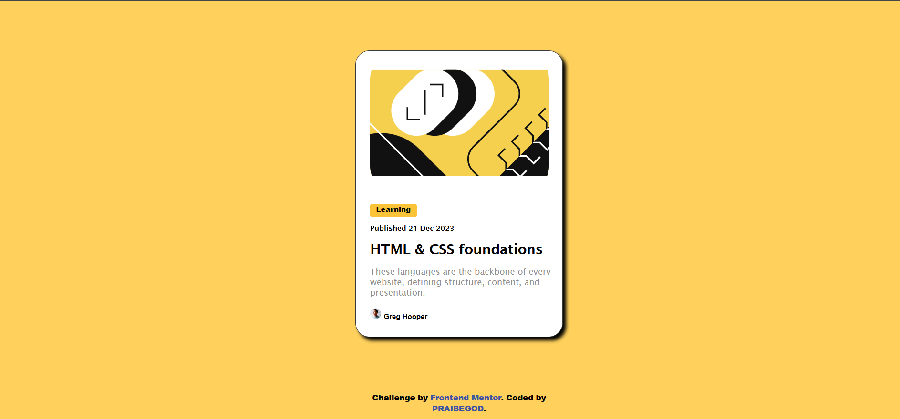

# Frontend Mentor - Blog preview card solution

This is a solution to the [Blog preview card challenge on Frontend Mentor](https://www.frontendmentor.io/challenges/blog-preview-card-ckPaj01IcS). Frontend Mentor challenges help you improve your coding skills by building realistic projects. 

## Table of contents

- [Overview](#overview)
  - [The challenge](#the-challenge)
  - [Screenshot](#screenshot)
  - [Links](#links)
- [My process](#my-process)
  - [Built with](#built-with)
  - [What I learned](#what-i-learned)
  - [Continued development](#continued-development)
  - [Useful resources](#useful-resources)
- [Author](#author)
- [Acknowledgments](#acknowledgments)


## Overview

### The challenge

Users should be able to:

- See hover and focus states for all interactive elements on the page

### Screenshot



### Links

- Solution URL: [https://github.com/Peolite1/Blog-Card.git](https://your-solution-url.com)
- Live Site URL: [](https://your-live-site-url.com)

## My process

### Built with

- Semantic HTML5 markup
- CSS custom properties
- Flexbox
- Mobile-first workflow

### What I learned

I lerrned alot from the first chalange which i used to, making corrections and applying them to this challange. in this challange i encounted a new styling element which alows me to make my webpage responsive in mobile, tablet and desktop mode. Puting this into use was very exciting. It also alloud me to make changes to my html element when its on the active state.
 See some code snippets below:

```html
<h1><b>HTML & CSS foundations</b></h1>
```
```css
h1:active:hover{
     color: rgb(252, 225, 155); 
 }

 @media(min-width: 1441px) {
    .me{
     max-width: 1440px;
     padding: 32px;
 }
}

```
Taking these challanges have helped me alot the pass few days, finding an uncovering new ways of styling elements to my taste. Cant wait for what comes next....😎

### Continued development
I'll focuse more on my webdevelopmet, even though its been long since i visited it, but with this challanges i might just be able to get back on track.

### Useful resources

- [https://www.coursera.org/](https://www.example.com) - This site really helped me in learning how to make my webpage responsive. I really liked this pattern and will use it going forward.

## Author

- Website - [Okorie PraiseGod.E.](https://www.your-site.com)
- Frontend Mentor - [@Peolite1](https://www.frontendmentor.io/profile/Peolite1)
- Twitter - [@prai79461](https://x.com/prai79461)

## Acknowledgments
Sometimes giving credit to one's self  is important...🙂
